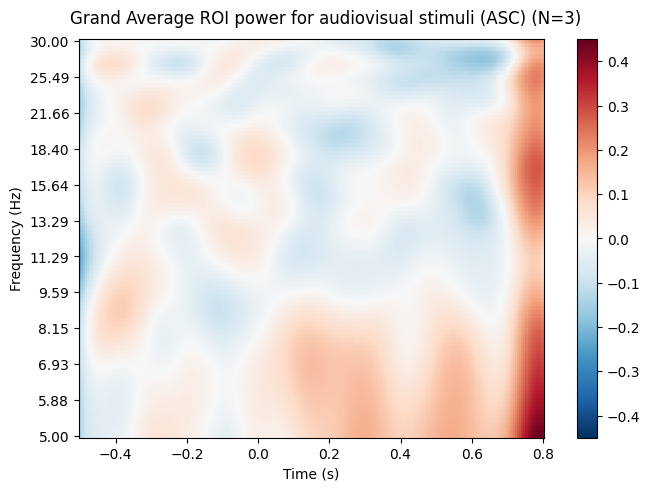
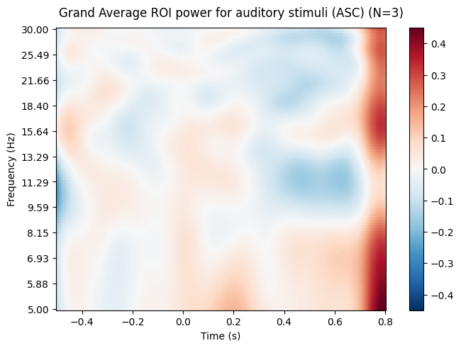
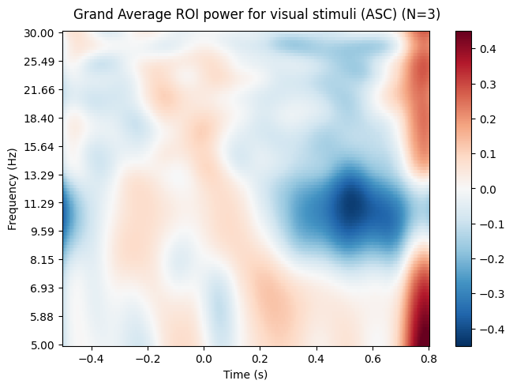
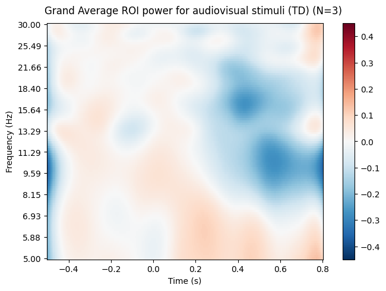
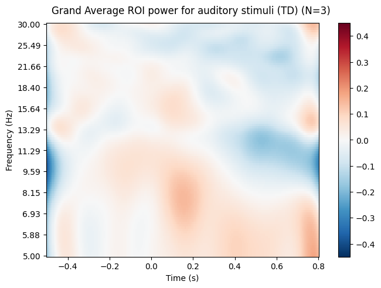
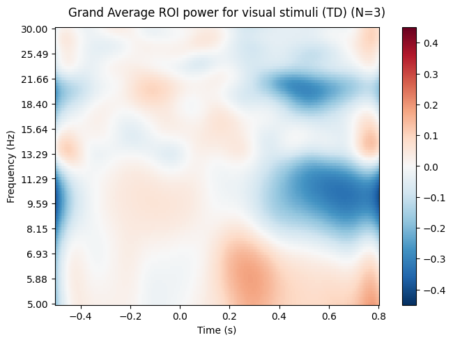

# Multi-timescale Neural Dynamics for Multisensory Integration in Autism Spectrum Condition
This is an ongoing project for Brainhack School 2026, which I try to do time-frequency analysis using MNE-Python. Dataset from [OpenNeuro ds006777](https://openneuro.org/datasets/ds006777/versions/1.0.0) would be used, and the entire processing/analyzing workflow and scripts will be updated.
## Background
- Our responses to multisensory stimuli typically differ from the combined responses of the corresponding unisensory stimuli. We have supra-additive responses which means the effect of multisensory integration is larger than combined unimodal responses; the other one is sub-additive responses, meaning that the effect of multisensory integration is smaller than the combined unimodal effects.
- Larger alpha suppression serves as a marker for increased integration of information, indexing heightened integration load. This multisensory integration (MSI) effect went beyond a mere summation of unimodal power responses alone[^1].
- Different timescales, reflected in different oscillatory frequency bands, serve to route different information types through cortical networks[^2].
- Individuals with autism spectrum condition (ASC) has altered MSI time window; however few studies investigated MSI on this population through a multi-timescale approach.
## Research Aims
- Comparing the MSI effects (measured with alpha suppression) between ASC and TD groups.
- Exploring the MSI effects across different frequency bands spatially and temporally.
## Dataset Description
- The dataset was downloaded from OpenNeuro ds006777[^3]. It is an EEG dataset collected by BioSemi system, and I would include TD and ASC participants in my analyses.
- Participants did an audiovisual simple reaction-time task (AVSRT). The stimulus type consisted of visual (V) stimulus alone, auditory (A) stimulus alone, and combined audiovisual (AV) stimuli simultaneously. What participants should do was press the button as quickly as possible when they detected any stimulus.
## Data Analyses
EEG preprocessing and time-frequency analysis would be done through MNE-Python 1.12.1[^7][^8] with a library [PyPREP](https://pyprep.readthedocs.io/en/stable/index.html)[^9] to detect noisy channels.
### How to run behavioral analysis and EEG preprocessing
- Both `eeg_preprocessing_and_beh_analysis.ipynb` and `batch_prep_beh.py` can be used for analyzing behavioral responses and preprocessing EEG data. To run the code, you should modify `base_dir` to your project folder directory.
- For `eeg_preprocessing_and_beh_analysis.ipynb`, you should specify which ONE subject you want to process in `subject_id`.
- For `batch_prep_beh.py`, you should specify which subject(s) to process in `subject_ids`. This script is mainly for processing multiple subjects without plotting functions.
- After running all the code, a folder for one subject would be created in `derivatives`. You can see that a `sub-*_beh.csv` file for behavioral results, a preprocessed epoch `sub-*_eeg-epo.fif` file, and a log `sub-*_log.txt` file would be saved in each subject's folder.

**NOTE** 
- Make sure you have also downloaded the `functions.py` file (which contains user-defined functions) and put all these scripts in the same folder.
- The main differences between `eeg_preprocessing_and_beh_analysis.ipynb` and `batch_prep_beh.py` are that the former is mainly for processing one subject in which plotting functions could be used and code can be run cell by cell; the latter can be directly run in the terminal and is mainly for automatic batch processing for multiple subjects at once, so no plottings would be shown when running the script. 
- The script was developed under Linux (specifically, Windows Subsystem for Linux, WSL). To see interactive plottings, for Linux/WSL you can install a matplotlib backend Qt by running `pip install pyqt6` in the terminal. For other operating systems, you can refer to [MNE official website](https://mne.tools/stable/install/advanced.html) for more details.
### Time-frequency analysis
The script `time-frequency_analysis.ipynb` is still under development.
## Interim Results
So far, three participants for each group (TD vs. ASC) have been analyzed, and six figures of time-frequency representation on three experimental conditions (AV, A, & V) for each group would be created like the followings:

<table>
  <tr>
    <td></td>
    <td></td>
    <td></td>
  </tr>
  <tr>
    <td></td>
    <td></td>
    <td></td>
  </tr>
</table>

[^1]: Matyjek, M., Kita, S., Torralba Cuello, M., & Soto Faraco, S. (2024). Multisensory integration of speech and gestures in a naturalistic paradigm. Human brain mapping, 45(11), e26797.
[^2]: Senkowski, D., & Engel, A. K. (2024). Multi-timescale neural dynamics for multisensory integration. Nature Reviews Neuroscience, 25(9), 625-642.
[^3]: Theo Vanneau, John J. Foxe, Shlomit Beker, Daniella Cohen, Albulena Sejdu, and Sophie Molholm (2025). SFARI AVSRT EEG. OpenNeuro. [Dataset] doi: doi:10.18112/openneuro.ds006777.v1.0.0
[^4]: Vanneau, T., Foxe, J. J., Beker, S., & Molholm, S. (2025). Disrupted Top-Down Modulation as a Mechanism of Impaired Multisensory Processing in Children with an Autism Spectrum Diagnosis. bioRxiv, 2025-11.
[^5]: Matyjek, M., Kita, S., Cuello, M.T., & Faraco, S.S. (2025), Multisensory Integration of Naturalistic Speech and Gestures in Autistic Adults. Autism Research, 18: 1156-1169.
[^6]: Gao, C., Xie, W., Green, J. J., Wedell, D. H., Jia, X., Guo, C., & Shinkareva, S. V. (2021). Evoked and induced power oscillations linked to audiovisual integration of affect. Biological psychology, 158, 108006.
[^7]: Larson, E., Gramfort, A., Engemann, D. A., Leppakangas, J., Brodbeck, C., Jas, M., Brooks, T. L., Sassenhagen, J., McCloy, D., Luessi, M., King, J.-R., Höchenberger, R., Brunner, C., Goj, R., Favelier, G., van Vliet, M., Wronkiewicz, M., Appelhoff, S., Rockhill, A., … user27182. (2026). MNE-Python (v1.12.1). Zenodo. https://doi.org/10.5281/zenodo.19666955
[^8]: Gramfort, A., Luessi, M., Larson, E., Engemann, D. A., Strohmeier, D., Brodbeck, C., ... & Hämäläinen, M. (2013). MEG and EEG data analysis with MNE-Python. Frontiers in Neuroinformatics, 7, 267.
[^9]: Bigdely-Shamlo, N., Mullen, T., Kothe, C., Su, K. M., & Robbins, K. A. (2015). The PREP pipeline: standardized preprocessing for large-scale EEG analysis. Frontiers in neuroinformatics, 9, 16.
